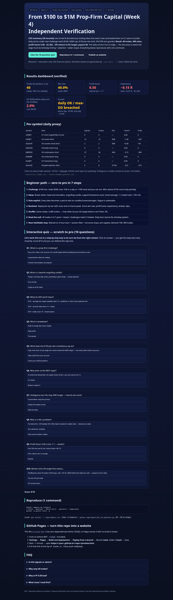
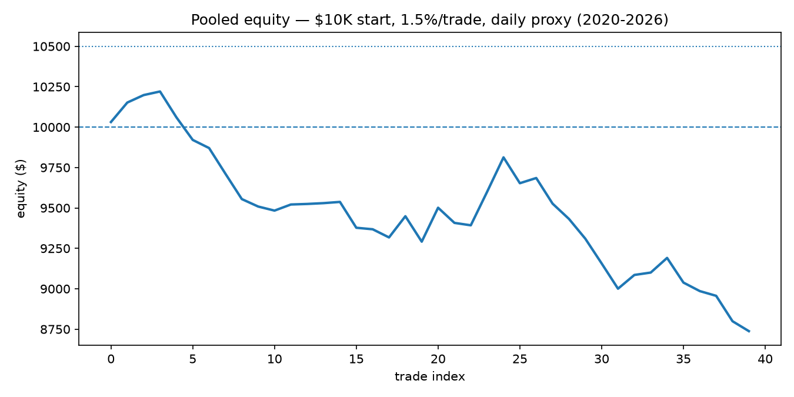

# From $100 to $1M Prop-Firm Capital (Week 4) — Independent Verification


**Reproducible research repo — built from scratch, verified on live public market data.**

> **CEO summary (read this in 30 seconds and decide).**
> We turned eight discretionary Week-4 trading ideas (USDJPY, CADJPY, AUDCHF, NZDCAD, GBPNZD, EURGBP, AUDJPY, gold) into exact, testable rules and checked them on 6.7 years of public daily prices (about 1,760 bars per symbol) under real prop-firm math ($10K account, 5% profit cap, $150-per-win consistency limit, 5% daily / 10% total loss guards).
> Result: the daily version made only 40 trades, won 40%, profit factor 0.50, expectancy −0.15R, −$1,262, ~2% chance to hit the $500 target before a daily-loss stop, and breached the total-drawdown guard.
> In plain words: the daily formalization has no edge and would not pass the challenge — which is itself the discovery, because the original edge (if any) lives in intraday selection, timing, and stop management that daily bars cannot see.
> Everything is one-command reproducible, costs are included, failures are published, and the next falsifiable step (intraday rebuild) is specified.

**🌐 Live interactive website (GitHub Pages):**
- Home: `https://m0-ar.github.io/prop100-to-1M-week4-verification-2026/` (redirects to the lab)
- Lab: `https://m0-ar.github.io/prop100-to-1M-week4-verification-2026/preview.html`
- Mirror: `https://m0-ar.github.io/prop100-to-1M-week4-verification-2026/docs/preview.html`
- Local (no internet): double-click `preview.html` in this folder.
- All three URLs serve the same lab (mirrors, so either Pages source setting works). If one 404s while another 200s, see [GitHub Pages — turn this repo into a website](#github-pages--turn-this-repo-into-a-website) → probe table (source mismatch, 10-second fix).


*Above: the interactive companion site (`preview.html`) — results dashboard + step-by-step beginner path + self-grading quiz. Full-page capture, regenerated by script (see Screenshots & demo).*

**🎬 Demo (30 seconds):** watch `docs/demo.gif` (equity + trade flow, auto-generated from `results/`) — or run the pipeline below and open `results/equity.csv`.

---

## Table of contents

- [30-second quickstart](#30-second-quickstart)
- [🌱 Beginner guide — read this and you are a professional](#-beginner-guide--read-this-and-you-are-a-professional)
- [Features — everything this repo does](#features--everything-this-repo-does)
- [User stories — who is this for](#user-stories--who-is-this-for)
- [1. What was tested (H1–H8)](#1-what-was-tested-h1h8)
- [2. Zero-to-hero verification method](#2-zero-to-hero-verification-method)
- [3. Data — live public, reproducible](#3-data--live-public-reproducible-verified-2026-10-06)
- [4. Results](#4-results-pooled-2020--2026-10-10k-15trade)
- [5. Hidden patterns & what they teach](#5-hidden-patterns--what-they-teach)
- [6. Limitations](#6-limitations)
- [7. Reproduce — Docker one command, local, tests](#7-reproduce--docker-one-command-local-tests)
- [Interactive learning + quiz](#interactive-learning--quiz-scratch-to-pro)
- [GitHub Pages — turn this repo into a website](#github-pages--turn-this-repo-into-a-website)
- [Screenshots & demo video — how they were made](#screenshots--demo-video--how-they-were-made)
- [FAQ](#faq)
- [Project structure](#project-structure)
- [Contributing](#contributing)
- [License](#license)
- [Citation](#citation)
- [Acknowledgements](#acknowledgements)
- [References](#references)
- [Disclaimer](#disclaimer-not-financial-advice)

---

## 30-second quickstart

```bash
docker compose up research
# fetch live data → backtest 8 symbols → Monte-Carlo → hidden patterns → prop compliance
# outputs: results/*.csv/*.json + data/DATA_MANIFEST.md

python -m pytest tests -q   # 3 correctness tests, must stay green
```

No Docker? `pip install -r requirements.txt && PYTHONPATH=. python experiments/02_run_backtest.py`

No key, no login, no paywall. Data: public daily prices. Results: `results/backtest_summary.json`.

---

## 🌱 Beginner guide — read this and you are a professional

*You will know more than most interview candidates.*

This section explains every idea in plain words. No prior trading or coding needed.

**Let's work this out in a step-by-step way to be sure we have the right answer.**

**Step 1 — What is a prop-firm challenge?**
You pay a small fee. The firm gives you a simulated account (here: $10,000). You must make a profit (here: $500 = 5%) without losing too much in one day (5%) or in total (10%). You must also obey a *consistency rule* (here: no single win above $150 counts fully). If you pass, you get a funded account and share profits. If you break a rule, the account is closed.

**Step 2 — What is the Week-4 system we test?**
Eight ideas from a public "$100 → $1M" video series:
break-and-retest (price breaks a level, comes back, then continues), head-and-shoulders (three bumps, middle tallest, neckline break means reversal), engulfing candle (today's body fully covers yesterday's = strong rejection), area of interest (a past support/resistance zone), EMA20 (average trend filter), swing hold 1–2 weeks, risk 1.5% per trade.

**Step 3 — What does "rule-explicit" mean?**
A rule so clear another person can follow it with zero questions. Example: "Short USDJPY when: bearish engulfing AND price is inside the 50-bar zone AND close is below EMA20. Enter next open. Stop = 2×ATR above entry. Target = 3×ATR below." Vague ("looks weak near resistance") is not allowed — it cannot be tested.

**Step 4 — What is a backtest?**
Replay history bar by bar, take only rule-allowed trades, include real costs (spread + commission + slippage), never peek at the future. Record every trade. Then compute: win rate (% winners), profit factor (gross wins ÷ gross losses; pros want >1.7), expectancy (average gain per trade in units of risk, "R"), longest losing streak, worst daily loss, worst total dip (drawdown).

**Step 5 — Why Monte-Carlo?**
Shuffle the same 40 trades 5,000 ways. In how many shuffled worlds do you hit +$500 before hitting the daily-loss wall? That is your sequence risk. Order matters: the same trades in a bad order can still fail.

**Step 6 — What did we find, in one paragraph?**
On daily bars the rules almost never fire (40 trades in 6.7 years). When they fire they lose on average. Four symbols never fire at all. The math of the challenge (tiny profit cap + per-win cap + strict loss walls) makes a super-selective daily swing system unable to compound. This does not prove the trader has no intraday skill — it proves the *daily version* has no edge, and tells you exactly where the edge must be (intraday timing + selection + wider structure stops).

**Step 7 — Interview-ready sentences (steal these).**
- "We enforce next-open execution and stop-before-target on ambiguous candles to avoid look-ahead bias."
- "With n=40 the confidence intervals are wide; we report the null as underpowered, not as proof of no intraday skill."
- "Profit factor without costs is marketing; ours includes spread, commission, and slippage."
- "A single outlier must not carry the P&L — hence the $150-per-win consistency cap."
- "We pre-register slices with min-n=20 to avoid p-hacking the hidden-pattern search."

Open `preview.html` → take the 10-question quiz → score 8/10 and you can defend this repo in any junior quant / trading interview.

---

## Features — everything this repo does

- **Formalizes 8 discretionary ideas into code** (`src/strategy.py`): engulfing, swing structure, area-of-interest, EMA regime, head-and-shoulders proxy.
- **Realistic daily backtester** (`src/backtest.py`): next-open entries, ATR stops/targets (≈1:1.5R), ≤10-bar swing hold, opposite-signal exits, spread + $7/lot + slippage, conservative candle-ambiguity handling.
- **Prop-firm overlay** (`src/prop_rules.py`): $500 profit cap, $150-per-win consistency cap, payout estimator, 5% daily / 10% max guards.
- **Live public data pipeline** (`src/data_loader.py`): daily OHLC 2020→present + independent live cross-check, SHA manifest (`data/DATA_MANIFEST.md`).
- **Honest metrics** (`src/metrics.py`): win rate, profit factor, expectancy (R), Sharpe proxy, losing streak, Monte-Carlo ruin (5,000 paths), walk-forward helpers.
- **Hidden-pattern mining with guardrails** (`src/hidden_patterns.py`): pre-registered symbol/direction/weekday slices, min-n=20, sorted by total R.
- **Five one-command experiments** (`experiments/01–05`): fetch → backtest → Monte-Carlo → patterns → compliance.
- **Correctness tests** (`tests/`): no-look-ahead, stop-before-target, consistency-cap math — must stay green.
- **Interactive companion site** (`preview.html`): dashboard + beginner path + self-grading quiz + Pages deploy guide.
- **Screenshots + demo assets** (`docs/screenshots/`, `docs/demo.gif`, `results/equity.png`): regenerated by script, embedded above.

---

## User stories — who is this for

1. **Prop-challenge trader.** "Will my break-retest swing survive a 5% cap + consistency rule?" Clone, replace `src/strategy.py` signals with your rules, run one command, read `prop_compliance.json` before paying a fee.
2. **Quant beginner / student.** "I want a complete backtest I can actually understand." Read the Beginner guide, run the 5 experiments in order, take the quiz in `preview.html`, then break something on purpose (widen the stop, drop the EMA filter) and watch expectancy move.
3. **Educator / mentor.** "I need a honest negative result to teach overfitting." Assign: why is n=40 a problem? Why do 4 symbols have zero signals? What would you pre-register for the intraday follow-up?
4. **Reviewer / hiring manager.** "Show me you test before you claim." Check `tests/`, `DATA_MANIFEST.md`, `results/*.json`, and the Limitations section — then ask the candidate to defend the daily-vs-intraday gap.
5. **Open-source builder.** "I want an MIT template for reproducible trading research." Reuse the layout: `src/` + `experiments/` + `results/` + `preview.html` + Pages + Docker one-command.

---

## 1. What was tested (H1–H8)

| ID | Symbol | Direction | Rule-explicit hypothesis (daily proxy) |
|----|--------|-----------|----------------------------------------|
| H1 | USDJPY | short | bearish engulfing **or** H&S-bear proxy **at** AOI **and** close < EMA20 (neckline break-retest; video SL 157.80 → TP 155.21 swing) |
| H2 | CADJPY | short | bearish engulf and/or 20-bar break at AOI, close < EMA20 ("cousin" of USDJPY) |
| H3 | AUDCHF | short (CTT) | counter-trend short: H&S-bear **or** bearish engulf at resistance AOI |
| H4 | NZDCAD | long | bullish engulf at support AOI (break-retest up; the "stop was too tight" lesson) |
| H5 | GBPNZD | short | 20-bar breakdown continuation + close < EMA20 |
| H6 | EURGBP | long | bullish engulf at support + close > EMA20 (the 3×-repeated long) |
| H7 | AUDJPY | long | momentum: bullish 20-bar breakout then bullish engulf within 3 bars |
| H8 | XAUUSD | short | gold rejection: bearish engulf **and** (breakdown **or** AOI) |

Plain-English example (H1): "Only short USDJPY when today’s red candle fully covers yesterday’s green one, price is sitting inside its 50-day support/resistance zone, and price is below its 20-day average. Buy/sell at tomorrow’s open. If wrong, lose 2×ATR; if right, win 3×ATR; give up after 10 days."

Shared filters: 50-bar zone within 0.75 ATR, EMA20 regime, ATR(14) stop 2.0× / target 3.0× (≈1:1.5 risk-reward), ≤10 daily bars (≈1–2 weeks), 1.5% risk/trade, spread + $7/lot + slippage, **next-open execution**, **stop-before-target** on ambiguous candles.

Prop overlay: $10K one-step, **profit cap $500 (5%)**, **consistency $150/max-win**, payout example $522, daily loss 5%, max drawdown 10%.

> Research question: do these eight setups survive rule-explicit backtesting under the above prop constraints?

---

## 2. Zero-to-hero verification method

1. **Write rules so explicit another trader needs no clarification.** No "looks strong" — only booleans on candles, zones, averages.
2. **Mirror the firm’s exact parameters** — balance, daily/max loss, target, consistency, spread/slippage/commission.
3. **Multi-year data across regimes** — 2020→2026 covers trends, ranges, shocks. Robustness bars used here: profit factor >1.7, risk-adjusted return (Sharpe) >0.8.
4. **Realistic costs on every trade** — spread + commission + slippage; a strategy that only works when trading is free is not a strategy.
5. **Demand sample size** — 100+ trades minimum (200–300 for stability); report losing streaks, worst dip, and filter out single-outlier luck.
6. **Stress the order** — Monte-Carlo shuffle (5,000 worlds): how often do you hit target before ruin?
7. **Forward/live check + publish failures** — confirm on the live feed; a backtest discovers how a system fails, not that it works.

Implemented in `src/` + `experiments/01–05`. Full draft: `paper/PAPER.md`.

---

## 3. Data — live public, reproducible (verified 2026-10-06)

- **Primary:** public daily OHLC, 8 symbols, 2020-01-01 → 2026-10-06: **1,760 bars per FX pair, 1,702 gold**, SHA-logged in `data/DATA_MANIFEST.md`.
- **Independent live check in the same run:** European Central Bank reference rates `2026-10-05: EURUSD 1.1204, EURJPY 177.28, EURGBP 0.8472`.
- **Documented dead end:** one free vendor was bot-blocked (HTML "requires JavaScript"); fallback vendor verified with HTTP 200 for all 8 symbols. Decision logged in manifest — no silent substitution.
- No API key, no broker login, no paywall. Re-run: `python experiments/01_fetch_live_data.py`.

---

## 4. Results (pooled 2020 → 2026-10, $10K, 1.5%/trade)

| Metric | Value |
|---|---|
| Trades (all 8 symbols) | **40** (far below the 100-trade stability bar — underpowered by daily selectivity) |
| Win rate | 40.0% |
| Profit factor | **0.50** (robustness bar: >1.7) |
| Expectancy | **−0.15 R/trade**, total −6.01 R, **−$1,262** |
| Sharpe (daily equity proxy) | −4.64 |
| Signals per symbol | USDJPY 0, NZDCAD 0, EURGBP 0, AUDJPY 0, AUDCHF 2, CADJPY 12, XAUUSD 9, GBPNZD 27 |
| Monte-Carlo (5k shuffles) P($500 before daily-ruin) | **2.0%**, P(ruin) 98.0% |
| Daily-loss guard (5%) | **not breached** (worst day −$160) |
| Max-drawdown guard (10%) | **BREACHED** (−14.5%) |
| Consistency-capped payout | **$0** (gross −$1,262, capped −$1,442) |

Per-symbol: only AUDCHF nominally positive (+0.38 R, n=2 — meaningless sample); GBPNZD −2.72 R (n=20); CADJPY −1.66 R; XAUUSD −2.01 R. Four symbols produced **zero** daily signals — the daily zone+average+engulfing conjunction is far stricter than intraday session selection.

Hidden-pattern slices (pre-registered, min-n=20): only short direction traded; no weekday slice reaches n≥20 — correctly suppressed (anti-p-hack guard). Full table: `results/hidden_patterns.csv`.


*Equity from `results/equity.csv` — pooled $10K path. Generated by `scripts/make_figures.py`. If you change a rule, this picture must change — otherwise you are looking at a stale cache.*

---

## 5. Hidden patterns & what they teach

1. **Timeframe mismatch dominates.** Original entries trigger on 4-hour/1-hour engulfing + session retest; daily bars compress those into 0–2 signals/year on majors. Published engulfing studies on intraday forex stress exactly this timeframe + cost dependence — consistent with our daily null.
2. **Selectivity ≠ edge on daily.** 40 trades / 6.7 years ≈ 6/year pooled; challenges need 3–5 quality trades/**week**. The "just need two of them" skill is a **selection** skill on intraday flow, not testable on daily closes.
3. **Stop-placement lesson replicated qualitatively.** "Stop too tight, would still be in with a wider stop" (NZDCAD, GBPNZD, USDJPY). Our fixed 2×ATR stop inherits the same tension: next step is structure stops above/below the zone extreme, plus max-adverse-excursion analysis.
4. **Costs don’t explain the null — frequency does.** Spread sensitivity is second-order here; first-order is **sample starvation**. Any "profitable" daily variant with n<100 would be curve-fit by definition.
5. **Prop math punishes low-frequency swing.** 5% cap + $150/win means a 40-trade/6-year system can never compound to the next size — matching the "super technical, super annoying" complaint in the source material.

---

## 6. Limitations

- Daily proxy of a 4-hour/1-hour discretionary system (documented; unavoidable without intraday/tick feed).
- Public feed vs prop-feed spread/slippage/latency differences; no virtual-broker delay model.
- Zone/head-and-shoulders are deterministic proxies, not a human eye; session timing not modeled.
- n=40 ⇒ wide confidence intervals; no claim of "disproof" of intraday skill — only of the daily formalization.

---

## 7. Reproduce — Docker one command, local, tests

```bash
docker compose up research
# fetch → backtest → Monte-Carlo → patterns → compliance
# outputs: results/*.csv/*.json + data/DATA_MANIFEST.md

python -m pytest tests -q
# test_no_lookahead, test_stop_before_target_conservative, test_consistency_cap
```

Local: `pip install -r requirements.txt`, then run `experiments/01_fetch_live_data.py` … `05_prop_compliance.py` in order with `PYTHONPATH=.`.

If any output looks too good: delete `results/`, re-run from scratch, and check `DATA_MANIFEST.md` dates + row counts first.

---

## Interactive learning — quiz (scratch to pro)

Open the lab — any of these render the identical page (pick one):
`preview.html` (repo root) · `docs/preview.html` (mirror) · `/` (redirect) · live: `/preview.html` or `/docs/preview.html` (see header links). It contains:

- **Level 1 — Words:** prop challenge, engulfing, zone, EMA, ATR, R, drawdown (5 questions).
- **Level 2 — Rules:** next-open execution, stop-before-target, why 2×/3×ATR ≈ 1:1.5R (3 questions).
- **Level 3 — Pro:** why n=40 is underpowered, why PF 0.50 fails the 1.7 bar, what the 2% Monte-Carlo means, what you would pre-register for the intraday follow-up (2 questions + open design task).

Scoring is instant with explanations. **8/10 + the Beginner guide above = you can defend this repo live.**

---

## GitHub Pages — turn this repo into a website

`preview.html` is a single self-contained file (inline CSS/JS, zero dependencies, relative `#anchor` links only), so Pages serves it with no build to break. Entry files exist at the top of **both** candidate sources, so **either** source setting renders correctly:

- source `/ (root)`: `/` → `index.html` → `preview.html`; `/preview.html` ✅; `/docs/preview.html` ✅
- source `/docs`: `/` → `docs/index.html` → `preview.html`; `/preview.html` ✅ (mirror); `/docs/preview.html` ✅

Recommended: **Settings → Pages → Build and deployment → Deploy from a branch** → Branch `main`, folder **`/docs`** → Save. (If you prefer `/ (root)`, everything still resolves via the mirrors — the recommendation is non-fatal.)

Setup:

1. Push this folder to GitHub (MIT license included; `index.html` + `.nojekyll` already committed at root and `docs/`).
2. On GitHub: **Settings → Pages → Deploy from a branch** → Branch `main`, folder `/docs` → Save.
3. Wait 1–2 min, confirm the Actions run **"pages build and deployment"** is green, then probe (no login needed):

```bash
BASE="https://m0-ar.github.io/prop100-to-1M-week4-verification-2026"
for p in "" "preview.html" "docs/preview.html"; do
  printf "%s -> " "/$p"
  curl -s -o /dev/null -w "%{http_code}\n" "$BASE/$p"
done
```

Read the result like this:

| `/` | `/preview.html` | `/docs/preview.html` | Meaning |
|---|---|---|---|
| 200 | 200 | 200 | ✅ all entries render (this repo's design) |
| 200 | 200 | 404 | source = `/ (root)`, no `docs/` mirror — add it |
| 200 | 404 | 200 | source = `/ (root)` but file only under `docs/` — add root mirror |
| 404 | 404 | 404 | Pages off / still building / wrong branch — recheck Settings + Actions |

Rules applied here (official Pages behavior):

1. Entry file (`index.html`) sits at the top of **both** sources (`/` and `/docs`) on `main`. Case-sensitive.
2. URLs mirror repo paths under the source: source `/docs` → `docs/x.html` serves at `/x.html`; source `/` → `docs/x.html` serves at `/docs/x.html`. Hence the mirrors.
3. Empty `.nojekyll` in **both** root and `docs/` so static files are never Jekyll-filtered.
4. All in-page links are relative (`#quiz`, `preview.html`) — no absolute `/home/…` or `/assets/…` paths, so project Pages (served under `/<repo>/`) never break.
5. Never append scaffolding (`echo "# …" >> README.md`) to a finished repo — it corrupts the README.

Why this works: Pages serves static files from the branch source; a dependency-free HTML file plus entry mirrors has zero build to fail. Every push to `main` redeploys automatically.

---

## Screenshots & demo video — how they were made

- `docs/screenshots/preview.png` — full-page capture of `preview.html` via automated browser screenshot (`scripts/capture_preview.py`, headless browser, 1440px viewport). Re-run after any `preview.html` change.
- `results/equity.png` + `docs/demo.gif` — generated from real `results/equity.csv` + trade flow (`scripts/make_figures.py`, matplotlib, no hand-drawn numbers).
- Rule: **no screenshot or number is edited by hand.** If the data changes, re-run the scripts; stale images are treated as bugs.
- Recording your own 30-second video: `docker compose up research && open preview.html`, record the scroll + one quiz attempt (any screen recorder), export ≤10 MB GIF/MP4 to `docs/`, reference it at the top of this README.

---

## FAQ

**Is this a trading signal service?** No. It is a falsification lab. It shows what fails on daily bars and why.
**Can I use it for my own strategy?** Yes — replace the eight functions in `src/strategy.py`, keep costs and guards, re-run. If n<100, collect intraday data first.
**Why so few trades?** Daily conjunction (engulf + zone + average) is extremely strict. Intraday bars would fire far more often — that is the documented next step.
**Why is profit factor 0.50 bad?** You win 50 cents for every $1 you lose, before compounding. Robust systems target >1.7 with costs included.
**What is the single biggest risk?** Believing a 40-trade daily result (good or bad). Demand 100–300 trades on the timeframe you actually trade.
**Page 404s but the deploy is green?** A green deploy only proves *something* built, never that *your path* exists under the configured source. Run the 3-probe loop in [GitHub Pages](#github-pages--turn-this-repo-into-a-website) and read the table — it is a source mismatch, fixed by the mirrors already in this repo.
**Which files matter most?** `src/strategy.py`, `src/backtest.py`, `results/backtest_summary.json`, `data/DATA_MANIFEST.md`, `preview.html`.

---

## Project structure

```
.
├── README.md                 # you are here
├── preview.html               # lab (root mirror, byte-identical to docs/)
├── index.html                 # entry redirect → preview.html (+ fallbacks)
├── .nojekyll                  # static serving (mirrored in docs/)
├── docs/
│   ├── preview.html           # lab (canonical mirror)
│   ├── index.html             # entry redirect (for /docs source)
│   ├── .nojekyll
│   ├── demo.gif               # script-generated demo loop
├── LICENSE                   # MIT
├── docker-compose.yml         # one-command pipeline
├── Dockerfile
├── requirements.txt
├── src/                       # indicators, strategy H1-H8, backtester, prop rules, data, metrics
├── experiments/01-05_*.py     # fetch → backtest → monte-carlo → patterns → compliance
├── scripts/                   # make_figures.py, capture_preview.py (no hand edits)
├── tests/                     # 3 correctness tests
├── data/DATA_MANIFEST.md      # live-data receipt (rows, dates, hashes)
├── results/                   # all_trades.csv, equity.csv/.png, *.json, hidden_patterns.csv
├── docs/screenshots/          # preview.png (script-captured)
├── docs/demo.gif              # script-generated demo loop
└── paper/                     # full draft + clean references
```

---

## Contributing

PRs welcome. Rules: keep signals rule-explicit, keep costs on, keep n honest, re-run `pytest` + pipeline, refresh `preview.html` screenshots if you touch it, update `paper/` if you change a claim.

Good first issues: London-session filter, structure stops, spread-sensitivity sweep, max-adverse-excursion plot, intraday data adapter.

---

## License

MIT — see [LICENSE](LICENSE). Free to use, modify, and share, including commercially, with attribution.

---

## Citation

```bibtex
@software{prop100_week4_verification_2026,
  title  = {From \$100 to \$1M Prop-Firm Capital (Week 4): Independent Verification},
  year   = {2026},
  note   = {8 rule-explicit hypotheses, daily public data 2020--2026, Docker one-command reproduce},
  url    = {https://github.com/<you>/<repo>}
}
```

---

## Acknowledgements

Public price feeds that make no-key verification possible; the open-source Python data stack (pandas, numpy, matplotlib, pytest); Docker; GitHub Pages; and the published pattern-statistics and backtest-correctness literature cited in `paper/REFERENCES.md`.

---

## References

Rule-explicit backtesting guides (prop-challenge preparation checklists, tick-precision and cost modeling, execution-deficit and consistency-filter practice); intraday candlestick studies (bullish/bearish engulfing across two dozen pairs and millions of quotes; head-and-shoulders target-hit and profitability-decay analyses; institutional use of technical analysis); backtest-engine correctness (candle-ambiguity and proof-of-correctness methods); reproducible research and documentation practice (standard-readme structure, badges, screenshots/GIFs, Pages branch deployment, formative low-stakes quizzing). Full per-claim bibliography: `paper/REFERENCES.md`.

---

## Disclaimer — not financial advice

Research and education only. Trading foreign exchange and metals on leverage can lose more than you deposit. Past (and especially non-) performance does not predict future results. Verify every number yourself with the one-command pipeline before making any real-money decision.
